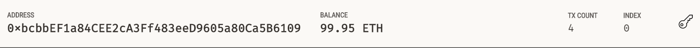

# Project Title: Blockchain

The project is to write code that enables your customers to send cryptocurrency payments to fintech professionals. They should be able to:
- Generate a new Ethereum account instance by using the mnemonic seed phrase provided by Ganache.
- Fetch and display the account balance associated with your Ethereum account address.
- Calculate the total value of an Ethereum transaction, including the gas estimate, that pays a Fintech Finder candidate for their work.
- Digitally sign a transaction that pays a Fintech Finder candidate, and send this transaction to the Ganache blockchain.
- Review the transaction hash code associated with the validated blockchain transaction.

FILES:
fintech_finder.py contains the code associated with the web interface of your application
crypto_wallet.py contains the Ethereum transaction functions 

---

## Technologies:

The project uses python 3.7 with the following packages:

* [pandas](https://pandas.pydata.org/) - For providing data analysis and manipulation tool built on top of the Python programming language

* [streamlit](https://streamlit.io/) - turns data scripts into shareable web apps

* [datclasses](https://docs.python.org/3/library/dataclasses.html) - This module provides a decorator and functions for automatically adding generated special methods to user-defined classes

* [typing](https://docs.python.org/3/library/typing.html) - This module provides runtime support for type hints

* [dotenv](https://pypi.org/project/python-dotenv/) - reads key-value pairs from a .env file and can set them as environment variables

* [bip44](https://github.com/bitcoin/bips/blob/master/bip-0044.mediawiki) - Multi-Account Hierarchy for Deterministic Wallets

* [web3](https://web3py.readthedocs.io/en/stable/) - is a Python library for interacting with Ethereum

---

## Installation Guide

Before running the application first install the following dependencies:

crypto_wallet.py
```python
import os
import requests
from dotenv import load_dotenv
load_dotenv()
from bip44 import Wallet
from web3 import Account
from web3 import middleware
from web3.gas_strategies.time_based import medium_gas_price_strategy
```

fintech_finder.py
```python
import streamlit as st
from dataclasses import dataclass
from typing import Any, List
from web3 import Web3
```

---

## Usage

To run the program, run the Streamlit application in the terminal by using `streamlit run *.py

Screenshots:




---

## Contributors

Jung Kim


---

## License

MIT License
